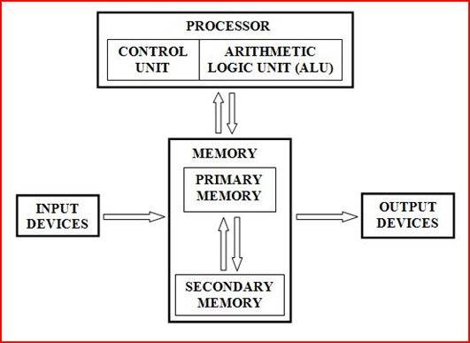

# Hello Everyone, Welcome to CMPE101 Seminar Series!
# CMPE101Seminar1: Introduction

In this series, I'll try to explain different topics to you, the newcomers of our department and while we continue the journey, I'll try to answer your questions at the Q/A part at every seminar. I'll try to be as basic and understandable as I can. If you think I assume you know sth, feel free to raise your hand and point that out.

The main purpose in this series are to explain you the simple principles of computers, and how to excel your communication with your computer and the code you've written.
In our first seminar which is this, we'll discuss an important topic that is "How Computers Work!" and after that I'll try to explain "How is Computer Structure at a Basic Level".
If you have questions about the general process, you can ask me right now.

If there're no questions, let's begin!

## First Part: How Computers Work

Computers are mechanical structures that are based on electronic circuits primarily. Central Processing Unit(CPU), Graphic Processing Unit(GPU), all microprocessors, your keyboard and touchpad/mouse are completely dependant to electricity and you know that today, everything is planned to be execute in an automated manner. For example, self driving cars, smart homes/cities, banking operations, cargo deliveries and many more. Day by day, this list expands and you and I are the candidates to expand this list with our effort.

Computers are based on binary number system and its successors if needed. When we try to explain an idea to anybody, we use letters in our language's alphabet to construct syllables, then words, then sentences and finally our explanation, with the aid of punctuation marks. In computers everything depends on 10 things, which are "1" and "0". "0" means 'NOTHING', whereas "1" means 'EVERYTHING'. By using these two digits, the scientists and engineers has developed many distinct encodings that depends on binary numbers for their own specific purpose. Everything you see or you'll see in Computer Engineering is based on binary numbers.
Let's look an example usage of binary numbers below.


The table above is created with a purpose which is to match a character to hexadecimal number on a one-to-one correspondence. For a computer, all these characters are just plenty of binary numbers and it has no idea of its meaning.

## For example, let's look at the word CMPE101 and spell it.
### For us, it is C-M-P-E-1-0-1. Simple, right?
### For computer, it is not that simple. The computer sees CMPE101 as this:
`01000011-01001101-01010000-01000101-00110001-00110000-00110001`

For now, let's do an example everyone.
- You can try to find out your name for an example. You can use this [link](https://www.binaryhexconverter.com/ascii-text-to-binary-converter) to see what's your name in binary number system.
- If you see a binary number starting with 1, your name includes special characters which are one or more of these: ["ç", "ğ", "ı", "ö", "ş", "ü"]. For these letters, there's another ascii table which is ASCII-Extended. You can check it from [here](https://www.ascii-code.com/).

What we do here is to give you a simple idea about computers and we've done the first one: Intuition of Binary Numbers. The more detailed information will be given in CMPE240 and CMPE344.

## Second Part: How is Computer Structure at a Basic Level

Let's dive deep and understand the mechanism behind this computers. What's their main structure of functioning? How can a data move through from memory to be used in an instruction and after the execution how are the results saved? I'll try to explain it in a simple and basic approach. This topic is more related to CMPE344 but it'll give you an insight of computer architecture which'll be useful when you start coding.

### Computer Architecture in a Simple Form


Let me clarify some terms:
- Instruction: Detailed information about how something should be done.
- Execution: It is a process of action from the very beginning to the end.
- Input devices: Anything can be possible, position of your fingers if it's a phone, mouse, keyboard, voice recorder, a file in the storage etc.
- Output devices: Anything can be possible, monitors, signal devices etc.
- Memory: It is a center of instantaneous or long-term storage. Primary memory is a memory which central processing unit(CPU) can directly access and it is usually referred as RAM, but there may be other referrals such as processor cache or system ROM. Secondary memory is a memory which CPU cannot access directly and it is usually referred as hard disk(HDD), solid state disk(SSD) or removable storage.
- Processor: It is the main actor of instruction execution. It uses primary memory for instantaneous actions and secondary memory for data storaging. It is the main control unit in a computer.

In this representation, input comes from internal or external input sources, then the incoming data put into primary memory first to be used at any moment, which is controlled by CPU. Then for a given instruction, the required data is pulled from the primary memory and used in processor to extract the results. At the end, if the results are requested to be stored, then processor requires secondary memory to store these results. 

To mimic the process, I have a demonstration. Try to follow me at the and do not memorize everything I do, just get the intuition of how I act.

## Example:

Now, let's do an example. It's time to act like a CPU. When we write our code and try to run it, what we do actually is that we've created our instructions to solve a problem and our computer takes our instructions to actually do the task that we've implemented in our solution. 

e.g.
``` python
def sum(a,b):
    return a+b

sum(5,4)
```

When we run this code block, actually we have some abstract instruction set in the code logic.
What the computer does is that it actually converts our high level instructions to low level binary instructions to execute on electronic circuits and CPU is the controlling unit of this whole process.

In the example below, we have our CPU, Primary & Secondary Memory, Input and Output parts. I'll give you several instructions and you'll try to act like a processor and control and execute the instruction set given to you. That'll help you understand the journey of your code from coding phase to the end of execution phase.


## Now, it's time for Q/A. Feel free to ask your questions!

Note: Use Raise Hand option in Zoom application to prevent multiple talker at the same time. I'll give you permission to ask your questions.